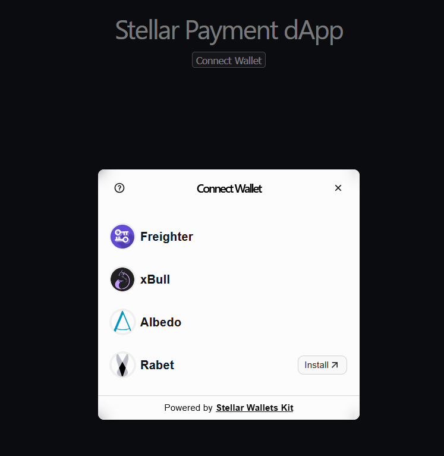
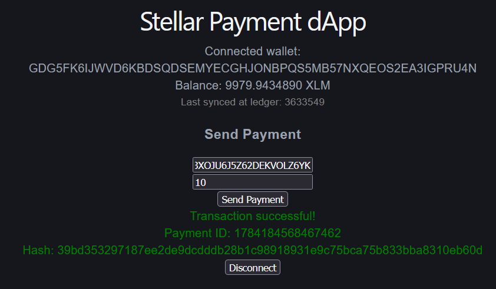
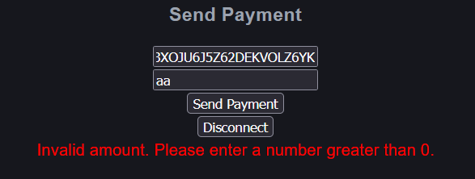
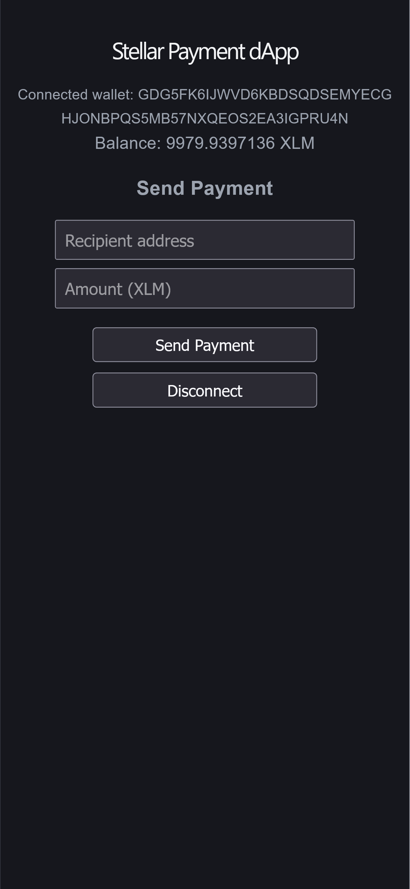
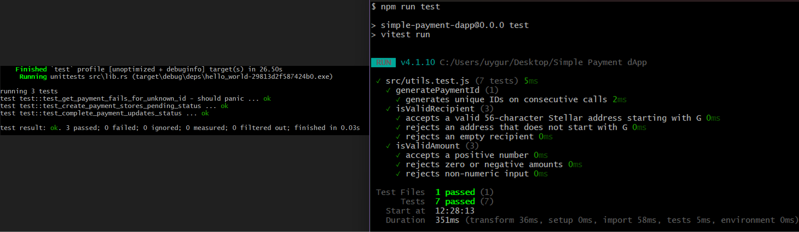

# Stellar Payment dApp

A decentralized application built on the Stellar Testnet that allows users to connect a Stellar wallet (Freighter, Albedo, xBull, or Rabet), view their XLM balance, and send payments through a deployed Soroban smart contract that tracks payment status. The app listens for on-chain contract events and updates automatically in real time.

This project was built for the Rise In Stellar Journey to Mastery program (Level 1 - White Belt, Level 2 - Yellow Belt).

## Features

- Connect and disconnect using multiple Stellar wallets (Freighter, Albedo, xBull, Rabet) via Stellar Wallets Kit
- Fetch and display the connected wallet's XLM balance
- Send XLM payments through a deployed Soroban smart contract
- Each payment is recorded on-chain with a unique payment ID and a status (`pending` / `completed`)
- Real-time updates: the app polls the Soroban RPC server for contract events and automatically refreshes the balance when a new payment is detected, without requiring a page reload
- Clear success or failure feedback for each transaction, including the payment ID and transaction hash
- Handles multiple distinct error cases: invalid recipient address, invalid amount, and network/contract failures
- Inter-contract communication: the Payment Tracker contract calls a separate Payment Logger contract on every payment
- Mobile responsive design
- Automated tests for both the smart contracts and the frontend, run automatically via CI/CD on every push

## Tech Stack

- React (Vite)
- @creit.tech/stellar-wallets-kit (multi-wallet support)
- @stellar/stellar-sdk
- Soroban (Stellar smart contracts, written in Rust)
- Stellar Testnet / Horizon / Soroban RPC

## Live Demo

[https://stellar-payment-dapp-seven.vercel.app/](https://stellar-payment-dapp-seven.vercel.app/)

## Smart Contracts

This project uses two Soroban smart contracts that communicate with each other (inter-contract communication):

### Payment Tracker Contract

Located in `payment-tracker-contract`. Functions:

- `create_payment` — creates a new payment record with sender, recipient, amount, and a `pending` status. Publishes a `PaymentCreated` event and calls the Payment Logger contract to increment its counter.
- `complete_payment` — updates a payment record's status to `completed`
- `get_payment` — retrieves a payment record by its ID
- `set_logger` — configures the address of the Payment Logger contract

**Deployed Contract ID (Testnet):**

```bash
CANPSJZKEBKEAROCQMEOF65HNFOAKN3EMWPRNVOC6PXMV7P6OWMS2LSO
```
You can verify the contract on [Stellar Expert (Testnet)](https://stellar.expert/explorer/testnet/contract/CANPSJZKEBKEAROCQMEOF65HNFOAKN3EMWPRNVOC6PXMV7P6OWMS2LSO).

### Payment Logger Contract

Located in `payment-logger-contract`. A simple contract called by the Payment Tracker to demonstrate inter-contract communication. Functions:

- `log_payment` — increments and returns a global payment counter
- `get_count` — retrieves the current payment counter

**Deployed Contract ID (Testnet):**

```
CBVXTCH3VJ7TR7LIYELFWC2V3IIGO7FR4QDGTXOWEI3AIEMZV4DUTXVY
```

**Example Transaction (Contract Call):**

```
https://stellar.expert/explorer/testnet/tx/39bd353297187ee2de9dcdddd28b1c98918931e9c75bca75b833bba8310eb60d
```

## Setup Instructions

### Frontend

1. Clone this repository:

```bash
git clone https://github.com/zuygur/stellar-payment-dapp.git
```

2. Navigate into the project folder:

```bash
cd stellar-payment-dapp
```

3. Install dependencies:

```bash
npm install
```

4. Start the development server:

```bash
npm run dev
```

5. Open the local address shown in the terminal (usually `http://localhost:5173`) in your browser.

6. Make sure the [Freighter wallet extension](https://www.freighter.app/) is installed and set to **Testnet**.

### Smart Contract Deployment (optional — already deployed)

If you want to build or redeploy the contract yourself:

1. Install [Rust](https://www.rust-lang.org/tools/install) and the [Stellar CLI](https://developers.stellar.org/docs/tools/developer-tools#stellar-cli).

2. Add the WASM build target:

```bash
rustup target add wasm32v1-none
```

3. Navigate into the contract folder:

```bash
cd payment-tracker-contract
```

4. Build the contract:

```bash
stellar contract build
```

5. Deploy to testnet:

```bash
stellar contract deploy --wasm target/wasm32v1-none/release/hello_world.wasm --source <your-identity> --network testnet
```

6. Deploy the Payment Logger contract the same way, from the `payment-logger-contract` folder.

7. Link the two contracts together:

```bash
stellar contract invoke --id <payment-tracker-contract-id> --source <your-identity> --network testnet -- set_logger --logger_contract_id <payment-logger-contract-id>
```

## Testing

### Smart Contract Tests

```
cd payment-tracker-contract
cargo test
```

3 tests covering payment creation, status updates, and error handling for missing records.

### Frontend Tests

```
npm run test
```

7 tests covering payment ID generation and input validation logic.

## CI/CD

This repository uses GitHub Actions to automatically run both frontend and contract tests on every push to `main`. See `.github/workflows/ci.yml`.

## Screenshots

### Wallet Connected State and Balance Display


### Successful Testnet Transaction and Transaction Result


### Freighter Wallet


### Wallet Options Available


### Wallet Connected, Balance, and Real-Time Sync


### Error Handling


### Mobile Responsive UI


### CI/CD Pipeline Running


### Test Output (Contract + Frontend)


## Notes

- The recipient account must already exist (funded) on the Testnet for a payment to succeed. New accounts can be funded using [Friendbot](https://friendbot.stellar.org/).
- Contract calls require higher network fees than simple payments, since they involve on-chain computation.
- The app checks for new contract events every 5 seconds while a wallet is connected.